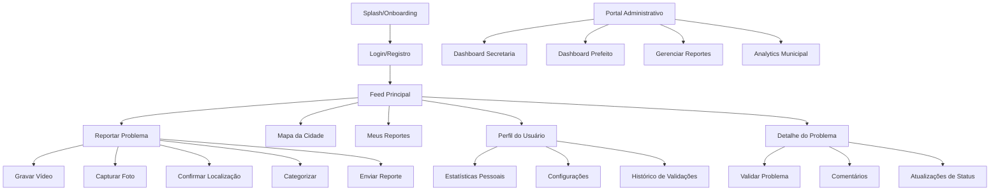
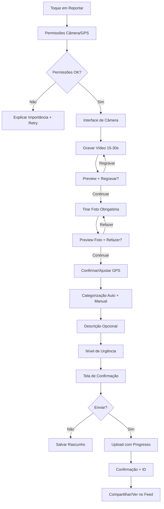

# KoePrefeito - Especificação UI/UX

## Introdução

Este documento define a experiência do usuário e especificações de interface para o KoePrefeito, uma plataforma de civic tech que conecta cidadãos e governo municipal através de vídeos curtos e geolocalização. O design deve equilibrar acessibilidade popular com seriedade institucional, criando confiança tanto para cidadãos quanto para gestores públicos.

### Objetivos Gerais de UX e Princípios

#### Personas de Usuário Alvo

**Cidadão Ativo (25-55 anos)**
- Morador engajado que quer ver melhorias na cidade
- Usa smartphone regularmente e redes sociais
- Busca canal efetivo para reportar problemas
- Quer acompanhar progresso e validar questões da comunidade

**Gestor Municipal**
- Prefeito, secretários e coordenadores
- Precisa de informações rápidas e acionáveis
- Busca demonstrar transparência e eficiência
- Quer métricas para tomada de decisão e prestação de contas

**Funcionário Público**
- Equipes operacionais das secretarias
- Precisa gerenciar demandas de forma organizada
- Busca ferramentas que facilitem o trabalho diário
- Quer comunicação clara com cidadãos

#### Objetivos de Usabilidade

- **Facilidade de aprendizado**: Novos usuários conseguem reportar problema em menos de 2 minutos
- **Eficiência de uso**: Cidadãos ativos fazem reporte completo em menos de 60 segundos
- **Prevenção de erros**: Interface guia usuário e previne submissões incorretas
- **Memorabilidade**: Usuários esporádicos lembram como usar após semanas
- **Satisfação**: Interface transmite que o problema será tratado com seriedade

#### Princípios de Design

1. **Humanização sobre tecnologia** - Mostrar rostos e vozes reais, não apenas dados
2. **Transparência progressiva** - Revelar informações conforme necessário
3. **Confiança institucional** - Design que transmite seriedade e competência
4. **Simplicidade funcional** - Remover fricção mantendo funcionalidades completas
5. **Acessibilidade por padrão** - Funcionar para todos os tipos de usuários

### Registro de Mudanças
| Data | Versão | Descrição | Autor |
|------|---------|-------------|--------|
| 13/01/2025 | 1.0 | Especificação inicial UI/UX | UX Expert Sally |

## Arquitetura da Informação (AI)

### Mapa do Site / Inventário de Telas



### Estrutura de Navegação

**Navegação Primária** (Tab Bar Inferior):
- **Início** (ícone casa): Feed principal de problemas
- **Reportar** (ícone câmera+): Criar novo reporte
- **Mapa** (ícone mapa): Visualização geográfica
- **Meus Reportes** (ícone lista): Histórico pessoal
- **Perfil** (ícone pessoa): Configurações e estatísticas

**Navegação Secundária**:
- Headers contextuais com voltar/ações
- Filtros e busca no feed principal
- Menus de contexto em cards de problemas

**Estratégia de Breadcrumb**:
Não aplicável para app mobile. Para versão web administrativa: Home > Departamento > Lista de Reportes > Detalhe

## Fluxos de Usuário

### Fluxo 1: Reportar Problema Urbano (Fluxo Principal)

**Objetivo do Usuário:** Reportar problema urbano com vídeo e localização

**Pontos de Entrada:** Tab "Reportar", botão flutuante no feed, atalho de onboarding

**Critérios de Sucesso:** Reporte submetido com confirmação e ID de rastreamento

#### Diagrama de Fluxo



#### Casos Extremos e Tratamento de Erros

- **GPS indisponível**: Seleção manual no mapa + validação de endereço
- **Falha de upload**: Retry automático + salvamento offline com sync posterior
- **Vídeo/foto com problemas**: Guias visuais e retry com dicas técnicas
- **Categorização incorreta**: Revisão pela comunidade + admin podem reclassificar

#### Notas

Fluxo otimizado para velocidade mantendo qualidade. Validações em tempo real evitam retrabalho.

### Fluxo 2: Validação Comunitária

**Objetivo do Usuário:** Confirmar problemas reportados por outros na mesma região

**Pontos de Entrada:** Feed principal, notificações de proximidade, busca no mapa

**Critérios de Sucesso:** Validação registrada + contribuição para score de credibilidade

#### Diagrama de Fluxo

```mermaid
graph TD
    A[Ver Problema no Feed] --> B[Toque em Card/Título]
    B --> C[Tela Detalhes Completos]
    C --> D{Está na Área?}
    D -->|Não| E[Mensagem: Muito Distante]
    D -->|Sim| F[Botão Validar Ativo]
    F --> G[Toque "Eu Vejo Isso Também"]
    G --> H[Feedback Tátil + Visual]
    H --> I[Atualizar Contador +1]
    I --> J[Pontos de Reputação +5]
    J --> K[Sugerir Problemas Similares]
```

#### Casos Extremos e Tratamento de Erros

- **Spam de validações**: Rate limiting + análise de padrões suspeitos
- **Localização imprecisa**: Buffer de 1km para validação + GPS em background
- **Problema já resolvido**: Status atualizado, validação desabilitada

### Fluxo 3: Dashboard Administrativo (Secretarias)

**Objetivo do Usuário:** Gerenciar reportes do departamento e atualizar status

**Pontos de Entrada:** Login administrativo direto, notificações push de emergência

**Critérios de Sucesso:** Reportes triados, status atualizados, cidadãos notificados

#### Diagrama de Fluxo

```mermaid
graph TD
    A[Login Admin] --> B[Dashboard Departamento]
    B --> C[Visão Kanban por Status]
    C --> D[Selecionar Reporte]
    D --> E[Ver Detalhes + Vídeo]
    E --> F{Ação Necessária?}
    F -->|Mais Info| G[Comentar/Solicitar Dados]
    F -->|Atualizar Status| H[Escolher Novo Status]
    F -->|Atribuir Equipe| I[Selecionar Responsável]
    H --> J[Adicionar Comentário Público]
    J --> K[Upload Foto "Antes/Depois"]
    K --> L[Salvar + Notificar Cidadão]
    L --> M[Atualizar Dashboard]
```

## Wireframes e Mockups

### Principais Arquivos de Design

**Arquivos de Design Primários:** Figma - KoePrefeito Design System
[Link será fornecido após criação dos wireframes detalhados]

### Layouts de Telas Principais

#### Tela de Feed Principal

**Propósito:** Mostrar problemas da região com capacidade de filtro e busca

**Elementos Principais:**
- Header com logo KoePrefeito + filtros rápidos + busca
- Cards de problema com thumbnail de vídeo + categoria + localização + validações
- Botão flutuante de reportar (sempre visível)
- Tab bar inferior para navegação

**Notas de Interação:** 
- Pull to refresh para atualizar feed
- Scroll infinito com loading skeleton
- Filtros: categoria, distância, status, urgência
- Toque longo em card para ações rápidas (validar, compartilhar)

**Referência de Arquivo de Design:** Figma Frame "01-Feed-Principal"

#### Tela de Gravação de Vídeo

**Propósito:** Interface intuitiva para gravar vídeo curto com instruções claras

**Elementos Principais:**
- Viewfinder em tela cheia com overlays mínimos
- Botão de gravação com contador de tempo (30s máx)
- Indicadores visuais: tempo restante, qualidade de GPS, flash
- Alternador de câmera frontal/traseira
- Botão de cancelar discreto no canto superior

**Notas de Interação:**
- Gravação: toque para iniciar/parar, hold para gravação contínua
- Preview automático após gravação com botões regravar/continuar
- Guias visuais para qualidade (enquadramento, iluminação)
- Fallback para foto se vídeo falhar

**Referência de Arquivo de Design:** Figma Frame "02-Camera-Interface"

#### Tela de Detalhe do Problema

**Propósito:** Visualização completa do problema com vídeo, validações e atualizações

**Elementos Principais:**
- Player de vídeo com controles (play/pause, thumbnail)
- Informações: localização, categoria, data, nível urgência
- Botão de validação "Eu vejo isso também" (se aplicável)
- Timeline de atualizações de status
- Seção de comentários públicos
- Mapa mini mostrando localização exata

**Notas de Interação:**
- Vídeo em autoplay mudo, toque para ativar som
- Validação com feedback visual imediato
- Compartilhamento via deeplink
- Botão "como chegar" integrado com GPS

**Referência de Arquivo de Design:** Figma Frame "03-Problema-Detalhes"

#### Dashboard Administrativo (Secretarias)

**Propósito:** Interface eficiente para gestão de reportes departamentais

**Elementos Principais:**
- KPIs no header: pendentes, resolvidos hoje, tempo médio
- Board kanban: Novos | Em Análise | Em Andamento | Resolvidos
- Cards de reporte com info essencial + ações rápidas
- Filtros por urgência, localização, responsável
- Ações em lote no footer quando selecionados múltiplos

**Notas de Interação:**
- Drag & drop entre colunas de status
- Seleção múltipla com checkboxes
- Modal para detalhes sem perder contexto da lista
- Notificações em tempo real para novos reportes urgentes

**Referência de Arquivo de Design:** Figma Frame "04-Admin-Dashboard"

## Biblioteca de Componentes / Sistema de Design

### Abordagem do Sistema de Design

**Estratégia do Sistema de Design:** Criar design system próprio "KoePrefeito DS" baseado em Material Design 3 com adaptações para identidade cívica brasileira

### Componentes Principais

#### Botão de Validação Comunitária

**Propósito:** Permitir que usuários confirmem problemas reportados por outros

**Variantes:** 
- Estado padrão: "Eu vejo isso também" + ícone olho
- Estado ativo: "Você validou" + ícone check + contador
- Estado desabilitado: "Muito distante" + ícone localização

**Estados:** Default, Hover, Pressed, Disabled, Validated

**Diretrizes de Uso:** Apenas visível quando usuário está dentro do raio de 1km. Feedback imediato com animação e haptic.

#### Card de Problema

**Propósito:** Exibir preview de problema reportado no feed

**Variantes:**
- Padrão: thumbnail + info básica + validações
- Urgente: borda vermelha + ícone alerta
- Resolvido: overlay verde com check
- Em análise: borda amarela + ícone relógio

**Estados:** Default, Pressed, Loading

**Diretrizes de Uso:** Sempre mostrar categoria com ícone, tempo relativo (ex: "há 2 horas"), distância aproximada. Toque abre detalhes, toque longo menu de ações.

#### Player de Vídeo Cívico

**Propósito:** Reproduzir vídeos curtos de problemas com controles otimizados

**Variantes:**
- Feed: autoplay mudo com overlay de play
- Detalhe: controles completos + transcrição
- Admin: velocidade 1.5x + pular para pontos-chave

**Estados:** Loading, Playing, Paused, Error, Transcribing

**Diretrizes de Uso:** Sempre começar mudo para economizar dados. Mostrar duração e possibilidade de transcrição. Controles grandes para acessibilidade.

#### Indicador de Status Municipal

**Propósito:** Mostrar progresso de resolução do problema de forma clara

**Variantes:**
- Reportado: círculo azul + "Recebido"
- Em Análise: círculo amarelo + "Analisando" 
- Em Andamento: círculo laranja + "Resolvendo"
- Resolvido: círculo verde + "Concluído"
- Rejeitado: círculo vermelho + "Não procede"

**Estados:** Cada status tem animação específica (pulse, loading, check)

**Diretrizes de Uso:** Sempre acompanhar de timestamp e comentário opcional da secretaria. Permitir toque para ver histórico completo.

#### Seletor de Categoria

**Propósito:** Categorização rápida e precisa de problemas urbanos

**Variantes:**
- Grid: 3x4 com ícones grandes + labels
- Lista: scroll vertical com ícones + descrições
- Sugestão: IA sugere categoria com opção manual

**Estados:** Default, Selected, Suggested (por IA)

**Diretrizes de Uso:** Máximo 12 categorias visíveis, scroll para ver "Outros". Ícones universais (ex: lâmpada para iluminação). Sugestão por IA sempre editável.

## Identidade Visual e Guia de Estilo

### Diretrizes da Marca

**Diretrizes da Marca:** Combinar confiança institucional com acessibilidade popular. Referências: Gov.br para seriedade + Waze para engajamento comunitário

### Paleta de Cores

| Tipo de Cor | Código Hex | Uso |
|-------------|------------|-----|
| Azul Institucional | #1E40AF | Elementos oficiais, headers, botões primários |
| Verde Cívico | #059669 | Sucesso, problemas resolvidos, validações |
| Laranja Alerta | #EA580C | Urgência média, atenção necessária |
| Vermelho Emergência | #DC2626 | Emergências, erros críticos, ações destrutivas |
| Cinza Neutro 900 | #111827 | Textos principais, ícones |
| Cinza Neutro 600 | #4B5563 | Textos secundários, placeholders |
| Cinza Neutro 100 | #F3F4F6 | Backgrounds, cards, separadores |
| Branco | #FFFFFF | Fundo principal, texto em botões escuros |

### Tipografia

#### Famílias de Fonte

- **Primária:** Inter (Google Fonts) - Modern, legível em qualquer tamanho
- **Secundária:** System Default (Roboto Android / SF Pro iOS) - Fallback nativo
- **Monospace:** JetBrains Mono - Códigos, IDs de reporte

#### Escala Tipográfica

| Elemento | Tamanho | Peso | Altura de Linha |
|----------|---------|------|-----------------|
| H1 | 32px | Bold | 40px |
| H2 | 24px | SemiBold | 32px |
| H3 | 20px | SemiBold | 28px |
| Corpo | 16px | Regular | 24px |
| Pequeno | 14px | Regular | 20px |
| Caption | 12px | Medium | 16px |

### Iconografia

**Biblioteca de Ícones:** Lucide React (outline style) + ícones customizados para categorias municipais

**Diretrizes de Uso:** Ícones sempre com label ou tooltip. Tamanho mínimo 24px para toque. Categorias com ícones universais (lâmpada, buraco, lixeira, etc.).

### Espaçamento e Layout

**Sistema de Grid:** 4px base unit, espaçamentos múltiplos de 4 (8, 16, 24, 32px)

**Escala de Espaçamento:** 
- xs: 4px - separadores finos
- sm: 8px - espaçamento interno de componentes  
- md: 16px - espaçamento entre componentes
- lg: 24px - espaçamento entre seções
- xl: 32px - margens principais
- 2xl: 48px - espaçamento de telas

## Requisitos de Acessibilidade

### Meta de Conformidade

**Padrão:** WCAG 2.1 Nível AA - Essencial para plataforma de serviço público

### Requisitos Principais

**Visual:**
- Contraste de cores: mínimo 4.5:1 para texto normal, 3:1 para texto grande
- Indicadores de foco: contorno azul de 2px, bem visível em fundos claros e escuros
- Dimensionamento de texto: suporte a zoom até 200% sem perda de funcionalidade

**Interação:**
- Navegação por teclado: todos os elementos interativos acessíveis via Tab
- Suporte a leitor de tela: labels descritivos, estados anunciados claramente
- Alvos de toque: mínimo 44x44px, espaçamento de 8px entre elementos

**Conteúdo:**
- Texto alternativo: todas as imagens com alt text descritivo
- Estrutura de cabeçalhos: hierarquia lógica H1->H2->H3
- Labels de formulário: associação explícita label-input

### Estratégia de Testes

**Ferramentas de Teste de Acessibilidade:** 
- axe-core para testes automatizados
- VoiceOver (iOS) e TalkBack (Android) para testes com leitor de tela
- Lighthouse accessibility audit integrado ao CI/CD

## Estratégia de Responsividade

### Breakpoints

| Breakpoint | Largura Mín | Largura Máx | Dispositivos Alvo |
|------------|-------------|-------------|-------------------|
| Mobile | 320px | 767px | Smartphones, foco principal |
| Tablet | 768px | 1023px | Tablets, iPads |
| Desktop | 1024px | 1439px | Laptops, desktops menores |
| Wide | 1440px | - | Monitores grandes, dashboards admin |

### Padrões de Adaptação

**Mudanças de Layout:**
- Mobile: navegação por abas, cards em coluna única, modais full-screen
- Tablet: navegação híbrida, cards em grid 2 colunas, modais centralizados
- Desktop: sidebar + conteúdo principal, cards em grid 3-4 colunas

**Mudanças de Navegação:**
- Mobile: tab bar inferior + hambúrguer para secundárias
- Tablet: tab bar + alguns itens no header
- Desktop: sidebar fixa com todas as opções

**Prioridade de Conteúdo:**
- Mobile: esconder informações secundárias, focar em ação principal
- Tablet: mostrar mais contexto, ações secundárias visíveis
- Desktop: informação completa, múltiplas ações simultâneas

**Mudanças de Interação:**
- Mobile: gestos de swipe, pull-to-refresh, toque longo
- Tablet: gestos + teclado ocasional
- Desktop: mouse hover, atalhos de teclado, drag & drop

## Animação e Micro-interações

### Princípios de Movimento

**Princípios de Movimento:**
- **Orientado a propósito**: animações que guiam atenção e fornecem feedback
- **Rápido mas perceptível**: 200-300ms para transições, 100ms para feedback
- **Easing natural**: curvas ease-out para entrada, ease-in para saída
- **Respeitoso de recursos**: animações pausáveis para economia de bateria

### Animações Principais

- **Envio de reporte**: Progress circle animado durante upload (Duração: variável, Easing: linear)
- **Validação comunitária**: Bounce + scale no botão + counter incrementando (Duração: 400ms, Easing: bounce)
- **Mudança de status**: Color transition + icon morph (Duração: 300ms, Easing: ease-out)
- **Carregamento de feed**: Skeleton shimmer + fade in de conteúdo (Duração: 200ms, Easing: ease-out)
- **Notificação de sucesso**: Slide down + auto dismiss (Duração: 250ms entrada + 3s display + 250ms saída, Easing: ease-out)
- **Navegação entre telas**: Slide horizontal iOS style (Duração: 300ms, Easing: ease-out)

## Considerações de Performance

### Objetivos de Performance

- **Carregamento de página:** Primeira tela visível em menos de 2 segundos em 3G
- **Tempo de resposta de interação:** Feedback visual em menos de 100ms para todos os toques
- **Meta de FPS de animação:** 60fps constante, degradação suave se necessário

### Estratégias de Design

**Otimização de imagens:** 
- Thumbnails de vídeo em WebP/AVIF com fallback JPEG
- Lazy loading para imagens fora da viewport
- Responsive images com srcset para diferentes densidades

**Estratégia de carregamento:**
- Skeleton screens para feeds longos
- Progressive loading: texto primeiro, imagens depois
- Infinite scroll com virtualization para listas grandes

**Estratégia de cache:**
- Service worker para cache de interface offline
- Cache de imagens local com expiração inteligente
- Preload de telas principais durante onboarding

## Próximos Passos

### Ações Imediatas

1. **Criação de wireframes detalhados** das 8 telas principais no Figma
2. **Desenvolvimento do design system** com componentes documentados
3. **Prototipação interativa** dos fluxos principais para validação
4. **Testes de usabilidade** com 5-8 usuários representativos de cada persona
5. **Refinamento baseado em feedback** e documentação de decisões

### Checklist de Handoff do Design

- [ ] Todos os fluxos de usuário documentados
- [ ] Inventário de componentes completo  
- [ ] Requisitos de acessibilidade definidos
- [ ] Estratégia responsiva clara
- [ ] Objetivos de performance estabelecidos
- [ ] Sistema de design implementado
- [ ] Protótipos interativos validados

## Resultados do Checklist

*[Este espaço será preenchido se houver checklist de UI/UX disponível]*